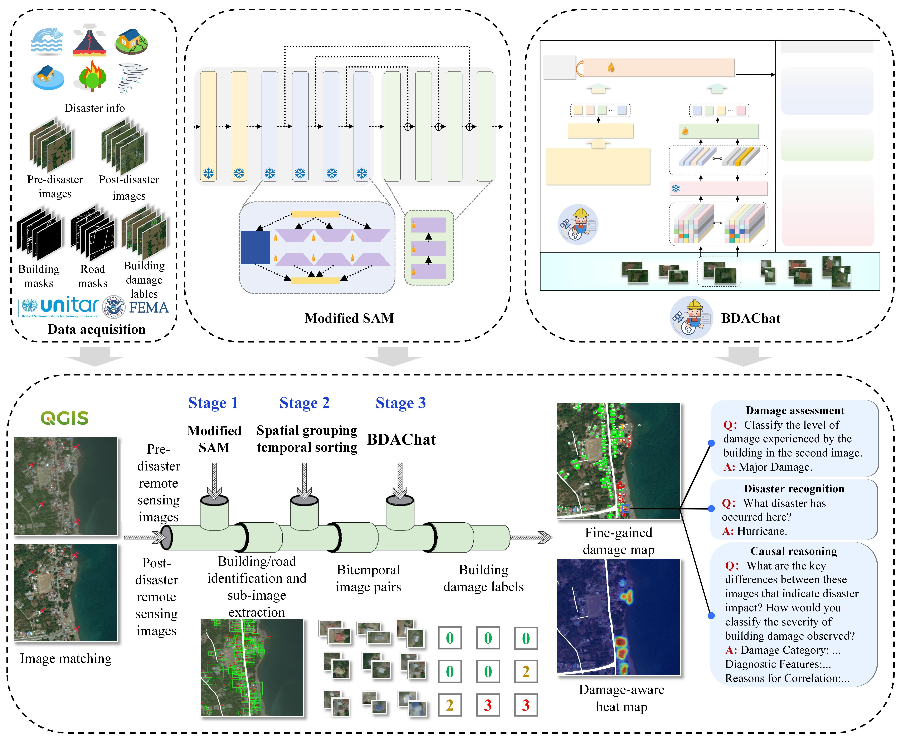
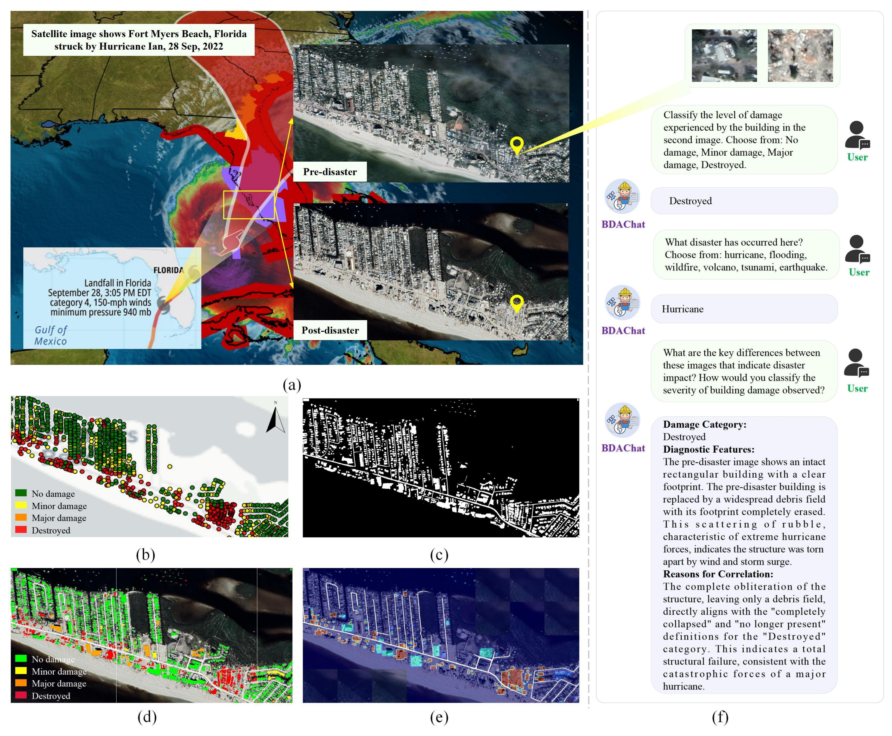

# Integrating Segmentation and Vision-Language Model for Automated and Interpretable Building Damage Assessment

[](https://opensource.org/licenses/MIT)
[](https://github.com/WangYong921/BDAChat)

This repository contains the official implementation of the paper: **"Integrating segmentation and vision-language model for automated and interpretable building damage assessment from satellite imagery"**.

**This work** is a novel three-stage framework that integrates instance segmentation with a temporal vision-language model (VLM) for automated, object-level, and interpretable assessment of structural assets from satellite imagery.

## 😮 Highlights

*   **Three-Stage Framework:** Synergizes high-precision segmentation, spatiotemporal data pairing, and VLM-based reasoning.
*   **Modified SAM:** A Multi-LoRA fine-tuned Segment Anything Model (SAM) adapted for high-performance building and road extraction in remote sensing imagery.
*   **Interpretable Reasoning:** Unlike black-box models, **BDAChat** (based on Video-LLaVA) provides damage classification, disaster recognition, and *causal explanations* in natural language.
*   **SOTA Performance:** Achieves state-of-the-art results on the xBD dataset (MF1 0.763) and demonstrates robust generalization on the unseen event.

## 🏗️ Framework Overview

The proposed framework consists of three main stages:
1.  **Segmentation:** Building and road extraction using **Modified SAM** with Multi-LoRA.
2.  **Alignment:** Spatial grouping and temporal sorting of building instances.
3.  **Assessment:** Multi-task visual question answering using **BDAChat**.



## 💾 Model Weights & Dataset Access

We provide the **OLBDA** dataset and pre-trained weights for both **Modified SAM** and **BDAChat** via Baidu Netdisk.

### 📚 Dataset
**OLBDA (Object-Level Building Damage Assessment)**
*   The first bitemporal image dataset for object-level building damage assessment based on remote sensing imagery, integrating multi-hazard generalization.
*   🔗 **Download:** [Baidu Netdisk](https://pan.baidu.com/s/1e6nw7auDnT81GB-u0ezwWQ?pwd=sbqm) (Extraction code: `sbqm`)

### 🤖 Model Weights
| Model | Description | Download Link |
| :--- | :--- | :--- |
| **Modified SAM** | Multi-LoRA fine-tuned SAM for high-precision segmentation | [Baidu Netdisk](https://pan.baidu.com/s/1Y795X0yZsI2mMzLneFQq5A?pwd=7qk7) (Code: `7qk7`) |
| **BDAChat-7B** | Fine-tuned Video-LLaVA for object-level damage assessment | [Baidu Netdisk](https://pan.baidu.com/s/1m1lHnq1a6hlqPYPBPuuMFg?pwd=qedm) (Code: `qedm`) |

## 🛠️ Requirements and Installation

1.  **Clone the repository:**
    ```bash
    git clone https://github.com/WangYong921/BDAChat.git
    cd BDAChat
    ```

2.  **Create a conda environment:**
    ```bash
    conda create -n bdachat python=3.9 -y
    conda activate bdachat
    ```

3.  **Install dependencies:**
    ```bash
    pip install torch torchvision torchaudio --index-url https://download.pytorch.org/whl/cu118
    pip install opencv-python numpy pandas pillow
    
    # Install specific requirements
    pip install -r requirements.txt
    ```
## 🚀 Pipeline Usage

The repository is structured to support the full pipeline from raw satellite imagery to fine-grained damage maps.

---

### 1. Data Preprocessing
Split large satellite orthophotos into manageable blocks for processing using the generation script.

```bash
python blocks_genegation.py
```
*   **Input:** Large post-disaster image (e.g., `hcpost.jpg`).
*   **Output:** Tiled images (e.g., `block_1_post_disaster.png`).

### 2. Segmentation (Stage 1): Modified SAM Extraction
Use the Modified SAM to generate high-fidelity building masks and road networks.
**Note:** Please download the Modified SAM weights and place them in `Modified_SAM/trained_weight/`.

#### 2.1 Road Extraction
```bash
# Train Road 
python Modified_SAM/train_sam_adapter_road.py --name 'b_adapter_sam_multi_lora'

# Test Road 
python Modified_SAM/test_road.py --name 'b_adapter_sam_multi_lora'
```
#### 2.1 Building Extraction
```bash
# Train Building
python Modified_SAM/train_sam_adapter_build.py --name 'b_adapter_sam_multi_lora'

# Test Building
python Modified_SAM/test_build.py --name 'b_adapter_sam_multi_lora'
```
### 3. Spatial Grouping & Temporal Sorting (Stage 2)
Extract and pair building instances from pre- and post-disaster images based on segmentation masks.
```bash
python sgts.py
```
### 4. BDAChat Training & Inference (Stage 3)

#### Preparation
1.  **Projector Weights:** Download `mm_projector.bin` from the [Video-LLaVA-Pretrain-7B model](https://huggingface.co/LanguageBind/Video-LLaVA-Pretrain-7B/tree/main) on Hugging Face.
2.  **Configure Paths:** Edit the training scripts to point to data (**OLBDA**) and checkpoints.

#### Training BDAChat
To fine-tune the model on the OLBDA dataset:
```bash
sh scripts/train_bdachat.sh
```
**Note:** Set --pretrain_mm_mlp_adapter to the path of the `mm_projector.bin` file you downloaded.
**Output:** Checkpoints will be saved to the directory specified in --output_dir.

#### Merging LoRA Weights
After training, merge the LoRA weights with the base model for inference:
```bash
python scripts/merge_lora_weights.py \
    --model-path /path/to/output/video-llava-7b-8bit-lora-experiment\
    --model-base /path/to/Video-LLaVA-7B \
    --save-model-path /path/to/checkpoints/bdachat-7B
```
#### Evaluation
To validate BDAChat on the test set or new data:
```bash
sh scripts/eval_bdachat.sh olbda_qa \
    /path/to/checkpoints/BDAChat-7B \
    /path/to/data/eval
```
**Output:** A JSON file (e.g., bdachat-7B_...json) containing textual responses and classifications.

### 5. Visualization & Mapping

Generate interpretable maps for decision support using the textual JSON outputs from Stage 3.

#### 5.1 Fine-Grained Damage Map
Projects the VLM classification results back onto the satellite image to visualize damage levels.
*   **Legend:** 🟢 No Damage, 🟡 Minor, 🟠 Major, 🔴 Destroyed.

```bash
python fine-grained_damagemap.py
```
#### 5.2 Damage-Aware Heatmap:
Generates a density heatmap of damaged areas to assess disaster impact intensity.
```bash
python damage-aware_heatmap.py
```
## 📸 Case Studies
*   **Lahaina Wildfire, Hawaii**

*   **Hurricane Ian, Florida**


## 📂 File Structure
```text
BDAChat/
├── BDAChat/                   # Code for the VLM (Stage 3)
├── Modified_SAM/              # Code for Segmentation (Stage 1)
├── assets/                    
├── blocks_genegation.py       # Image tiling script
├── sgts.py                    # Spatial grouping and temporal sorting (Stage 2)
├── fine-grained_damagemap.py  # Visualization: Fine-grained_damagemap
├── damage-aware_heatmap.py    # Visualization: Damage-aware_heatmap
├── LICENSE
└── README.md
```
## 👍 Acknowledgement

This work heavily relies on the contributions of the following excellent open-source projects and datasets:

*   **Dataset:**
    *   **xBD Dataset:** For dataset construction. [[Link](https://xview2.org/)]
*   **Foundation Models & Frameworks:**
    *   **Segment Anything (SAM):** For high-precision instance segmentation in Stage 1. [[GitHub](https://github.com/facebookresearch/segment-anything)]
    *   **Video-LLaVA:** Serving as the base architecture for the temporal VLM, BDAChat. [[Link](https://github.com/PKU-YuanGroup/Video-LLaVA)]
    *   **TEOChat:** For inspiration on handling temporal visual sequences in VLM context. [[GitHub](https://github.com/ermongroup/TEOChat)]

## ✏️ Citation
If you find our work useful in your research, please consider citing:

```Bibtex
@article{wang2025BDAChat,
  title={Integrating segmentation and vision-language model for automated and interpretable building damage assessment from satellite imagery},
  author={Wang, Yong and Cui, Jiawei and Zhai, Changhai and Tao, Xigui and Li, Yuhao},
  journal={},
  year={}
}
```
## 📜 License
This project is released under the MIT License.

